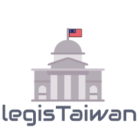

<!-- README.md is generated from README.Rmd. Please edit that file -->

# Accessing Real-time and Archives of Taiwan Legislative Data in R 

<!-- badges: start -->

[](https://github.com/davidycliao/legisTaiwan/actions/workflows/r.yml)
[](https://codecov.io/gh/davidycliao/legisTaiwan)
[](https://github.com/davidycliao/legisTaiwan/actions/workflows/R-CMD-check.yaml)
[](https://github.com/davidycliao/legisTaiwan/actions/workflows/test-coverage.yaml)
[](https://github.com/davidycliao/legisTaiwan/actions/workflows/pkgdown.yaml)
[](https://www.codefactor.io/repository/github/davidycliao/legistaiwan)
[](https://lifecycle.r-lib.org/articles/stages.html#experimental)
<!-- badges: end -->

<div style="text-align: justify">

`legisTaiwan` is designed to make it quickly and easily to download the
real-time and archives of Taiwan legislative data via [Taiwan
Legislative Yuan API](https://data.ly.gov.tw/index.action). Its initial
development was part of David Yen-Chieh Liao’ Dissertation project
**[Electoral Reform, Distributive Politics, and Parties in the Taiwanese
Congress](https://raw.githack.com/davidycliao/phd-thesis/main/Yen_Chieh_Liao_PhD_Dissertation_Jan_2023.pdf)**\*
supported by Taiwanese Overseas Pioneers Grant (TOP GRANT), the National
Science and Technology Council (NSTC) of Taiwan.

</div>

## Get Started with Using [`remotes`](https://github.com/r-lib/remotes):

``` r
install.packages("remotes")
remotes::install_github("davidycliao/legisTaiwan", force = TRUE)
```

``` r
library(legisTaiwan)
#> ## legisTaiwan                                            ###
#> ## An R package connecting to the Taiwan Legislative API. ###
```

## Notice and Information:

- Two API endpoints (`質詢事項(本院委員質詢部分)` and `國是論壇`) are
  temporarily down. Therefore, the data retrieved by
  `get_parlquestions()` and `get_public_debates()` may not be correct.
  \[*UPDATE: Feb 5 2023*\]
