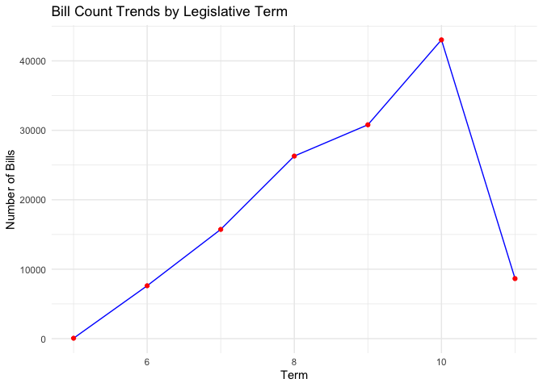
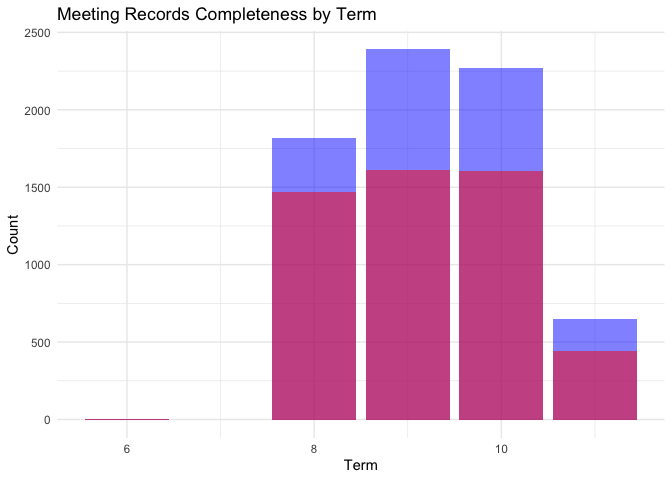
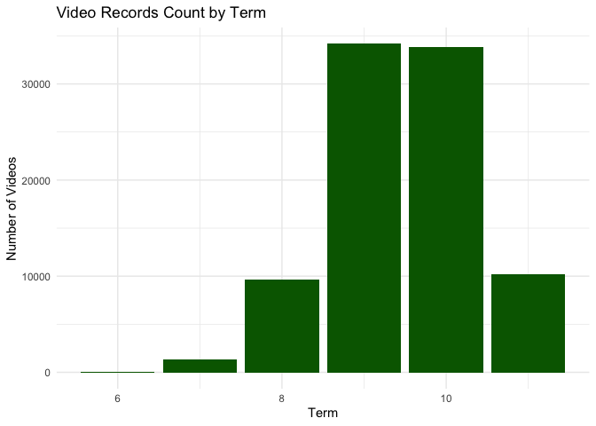

<!-- README.md is generated from README.Rmd. Please edit that file -->

## Real-time and Archives of Taiwan Legislative Data in R 

<!-- badges: start -->

[](https://codecov.io/gh/davidycliao/legisTaiwan)
[](https://github.com/davidycliao/legisTaiwan/actions/workflows/R-CMD-check.yaml)
[](https://github.com/davidycliao/legisTaiwan/actions/workflows/test-coverage.yaml)
[](https://github.com/davidycliao/legisTaiwan/actions/workflows/pkgdown.yaml)
[](https://www.codefactor.io/repository/github/davidycliao/legistaiwan)
[](https://doi.org/10.5281/zenodo.7633962)
<!-- badges: end -->

<!-- <div style="text-align: justify"> -->

<!-- `legisTaiwan` is designed to streamline access to real-time archives of Taiwan's legislative data, drawing inspiration from the UK's TheyWorkForYou API. By providing straightforward access to the Taiwan Legislative Yuan API in R, this package not only aims to enhance legislative accountability and public transparency but also serves as a powerful tool for academic research. Scholars can easily retrieve and analyze legislative data including voting records, parliamentary questions, and bill proposals, facilitating quantitative research and empirical analysis. As the package interfaces directly with Legislative Yuan API endpoints, a stable internet connection is required. Users are welcome to contact [the author](https://davidycliao.github.io) for any API implementation assistance. -->

<!-- </div> -->

<div style="text-align: justify; font-size: 1.1rem; line-height: 1.6; color: #333; max-width: 800px; margin: 1rem auto; padding: 0 1rem; font-family: 'Helvetica Neue', Arial, sans-serif;">

`legisTaiwan` is designed to streamline access to real-time archives of
Taiwan’s legislative data, drawing inspiration from the UK’s
TheyWorkForYou API. By providing straightforward access to the Taiwan
Legislative Yuan API in R, this package not only aims to enhance
legislative accountability and public transparency but also serves as a
powerful tool for academic research. Scholars can easily retrieve and
analyze legislative data including voting records, parliamentary
questions, and bill proposals, facilitating quantitative research and
empirical analysis. As the package interfaces directly with Legislative
Yuan API endpoints, a stable internet connection is required. Users are
welcome to contact
<a href="https://davidycliao.github.io" style="color: #3498db; text-decoration: none; border-bottom: 1px solid #3498db;">the
author</a> for any API implementation assistance.

</div>

<div style="text-align: justify; font-size: 0.95rem; line-height: 1.6; color: #333; max-width: 800px; margin: 1rem auto; padding: 0 1rem; font-family: 'Helvetica Neue', Arial, sans-serif;">

`legisTaiwan`
套件旨在簡化台灣立法院資料的即時存取，其設計理念來自於英國的
[`TheyWorkForYou API`](https://www.theyworkforyou.com/api/)。透過在 R
環境中提供直接連接立法院開放資料 API
的便捷管道，本套件不僅致力於提升立法問責制和公共透明度，更為學術研究者提供了系統化分析立法數據的工具。研究人員可以輕鬆獲取並分析立法委員的表決紀錄、問政質詢、法案提案等資料，有助於量化研究和實證分析。由於套件需要直接與立法院
API 介接，使用時請確保網路連線穩定。如有任何 API
使用上的問題，歡迎與套件<a href="https://davidycliao.github.io" style="color: #3498db; text-decoration: none; border-bottom: 1px solid #3498db;">我們</a>聯繫。

</div>

<br>

### Get Started with Using [`remotes`](https://github.com/r-lib/remotes):

``` r
install.packages("remotes")
remotes::install_github("davidycliao/legisTaiwan", force = TRUE)
```

    library(legisTaiwan)
    #> ## legisTaiwan                                            ##
    #> ## An R package connecting to the Taiwan Legislative API. ##

### Summary Descriptive of Taiwan Legilative Yuan API

**Legislative Bills Statistics**

``` r
analyze_bills(stats)
#> 
#> === Bill Statistics Summary ===
#> Total Bills: 132235
#> Last Updated: 2025-01-21 19:20:01
#> 
#> First Five Terms Bill Count:
#>   term count percentage cumulative
#> 1   11  8651       6.54       8651
#> 2   10 43029      32.54      51680
#> 3    9 30806      23.30      82486
#> 4    8 26293      19.88     108779
#> 5    7 15775      11.93     124554
#> $plot
```



    #> 
    #> $summary
    #>   term count percentage cumulative
    #> 1   11  8651       6.54       8651
    #> 2   10 43029      32.54      51680
    #> 3    9 30806      23.30      82486
    #> 4    8 26293      19.88     108779
    #> 5    7 15775      11.93     124554
    #> 6    6  7622       5.76     132176
    #> 7    5    59       0.04     132235

**Legislative Meeting Statistics**

``` r
analyze_meetings(stats)
#> 
#> === Meeting Statistics Summary ===
#> Total Meetings: 7128
#> 
#> Meeting Records Statistics by Term:
#>   term count    max_meeting_date meetdata_count 議事錄_count minutes_ratio
#> 1   11   652 2025-02-13 00:00:00            627          447         68.56
#> 2   10  2267 2024-05-17 01:00:00           2146         1603         70.71
#> 3    9  2390 2020-01-22 00:00:00           2237         1645         68.83
#> 4    8  1818 2015-12-18 00:00:00           1434         1480         81.41
#> 5    6     1                <NA>              0            1        100.00
#>   last_meeting_date
#> 1        2025-02-13
#> 2        2024-05-17
#> 3        2020-01-22
#> 4        2015-12-18
#> 5              <NA>
#> $plot
```



    #> 
    #> $summary
    #>   term count    max_meeting_date meetdata_count 議事錄_count minutes_ratio
    #> 1   11   652 2025-02-13 00:00:00            627          447         68.56
    #> 2   10  2267 2024-05-17 01:00:00           2146         1603         70.71
    #> 3    9  2390 2020-01-22 00:00:00           2237         1645         68.83
    #> 4    8  1818 2015-12-18 00:00:00           1434         1480         81.41
    #> 5    6     1                <NA>              0            1        100.00
    #>   last_meeting_date
    #> 1        2025-02-13
    #> 2        2024-05-17
    #> 3        2020-01-22
    #> 4        2015-12-18
    #> 5              <NA>

**Legislative Video (IVOD) Statistics**

``` r
analyze_ivod(stats)
#> 
#> === Video Statistics Summary ===
#> Total Videos: 89284
#> Data Period: 2005-03-14 to 2025-01-20
#> 
#> Video Statistics by Term:
#>   term count          start_date            end_date start_date_fmt
#> 1   11 10259 2024-02-05 07:00:00 2025-01-20 16:00:00     2024-02-05
#> 2   10 33852 2020-02-14 06:00:00 2024-01-09 01:00:00     2020-02-14
#> 3    9 34167 2016-02-19 01:00:00 2020-01-20 01:00:00     2016-02-19
#> 4    8  9608 2012-02-24 01:00:00 2015-12-18 01:00:00     2012-02-24
#> 5    7  1364 2008-02-29 01:00:00 2011-12-14 01:00:00     2008-02-29
#>   end_date_fmt period_days avg_daily_videos
#> 1   2025-01-20     350.375            29.28
#> 2   2024-01-09    1424.792            23.76
#> 3   2020-01-20    1431.000            23.88
#> 4   2015-12-18    1393.000             6.90
#> 5   2011-12-14    1384.000             0.99
#> $plot
```



    #> 
    #> $summary
    #>   term count          start_date            end_date start_date_fmt
    #> 1   11 10259 2024-02-05 07:00:00 2025-01-20 16:00:00     2024-02-05
    #> 2   10 33852 2020-02-14 06:00:00 2024-01-09 01:00:00     2020-02-14
    #> 3    9 34167 2016-02-19 01:00:00 2020-01-20 01:00:00     2016-02-19
    #> 4    8  9608 2012-02-24 01:00:00 2015-12-18 01:00:00     2012-02-24
    #> 5    7  1364 2008-02-29 01:00:00 2011-12-14 01:00:00     2008-02-29
    #> 6    6    34 2005-03-23 01:00:00 2007-12-10 01:00:00     2005-03-23
    #>   end_date_fmt period_days avg_daily_videos
    #> 1   2025-01-20     350.375            29.28
    #> 2   2024-01-09    1424.792            23.76
    #> 3   2020-01-20    1431.000            23.88
    #> 4   2015-12-18    1393.000             6.90
    #> 5   2011-12-14    1384.000             0.99
    #> 6   2007-12-10     992.000             0.03

<!-- ```{r include=FALSE} -->

<!-- create_interactive_plot(stats) -->

<!-- ``` -->

<br>

### Notice: API Migration

<div style="text-align: justify; font-size: 1.1rem; line-height: 1.6; color: #333; max-width: 800px; margin: 1rem auto; padding: 0 1rem; font-family: 'Helvetica Neue', Arial, sans-serif;">

The Legislative Yuan API has transitioned from `https://ly.govapi.tw` to
`https://v2.ly.govapi.tw`. While we are still supporting functions that
use the legacy API, please note that according to official notice, the
old API endpoint will not be maintained. We recommend users to gradually
transition to [the newer functions]() attached with API V2.

</div>

### Support

<div style="text-align: justify; font-size: 1.1rem; line-height: 1.6; color: #333; max-width: 800px; margin: 1rem auto; padding: 0 1rem; font-family: 'Helvetica Neue', Arial, sans-serif;">

如果您覺得這個套件對您的研究有幫助，歡迎考慮小額捐款給[台灣公民監督國會聯盟](https://ccw.org.tw/donation)或[報導者](https://support.twreporter.org)，支持台灣獨立媒體的持續營運和國會監督工作。如果您對資料分析有任何問題，也歡迎與我聯繫討論。

If you find `legisTaiwan` helpful for your research, you are welcome to
consider making a small donation to [the Taiwan Congress Watch
Foundation](https://ccw.org.tw/donation) or [The
Reporter](https://support.twreporter.org) to support Taiwan’s
independent media operations and parliamentary oversight work. If you
have any questions about data analysis, feel free to contact us for
discussion.

</div>

<br>
